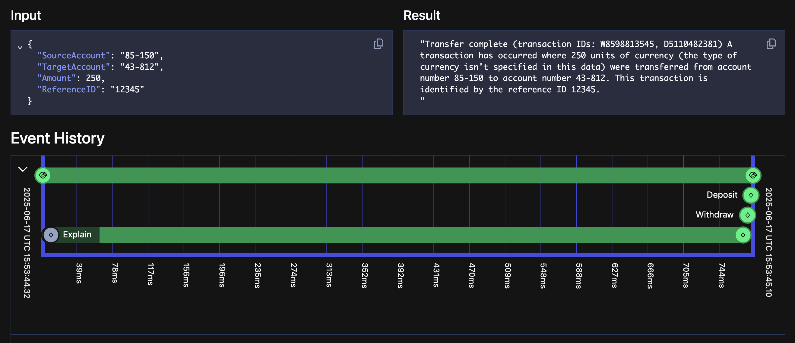

# temporal-play

A small repo to play around with the Go SDK for Temporal.

```bash
nixd

just temporal-up # runs the temporal server locally
just worker # runs a temporal worker locally
just run # runs the temporal workflow locally (Temporal CLI)

just fmt
```

## Changes to the base example

The majority of the code is pulled from Temporal's SDK tutorial, the main change was that I wanted to add in an activity that interacts with an LLM (Gemini in this case).
The goal simply being to get a feel for using Temporal as a data enrichment pipeline (separate ideas for other work).


